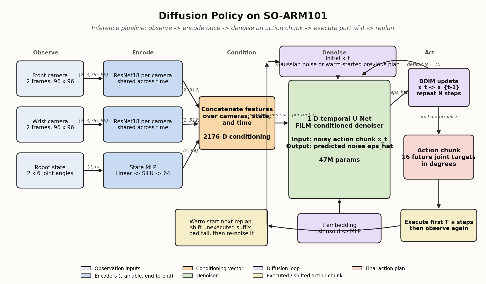
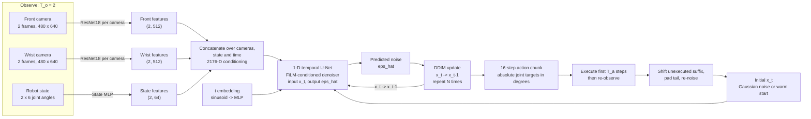
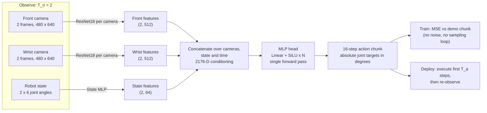
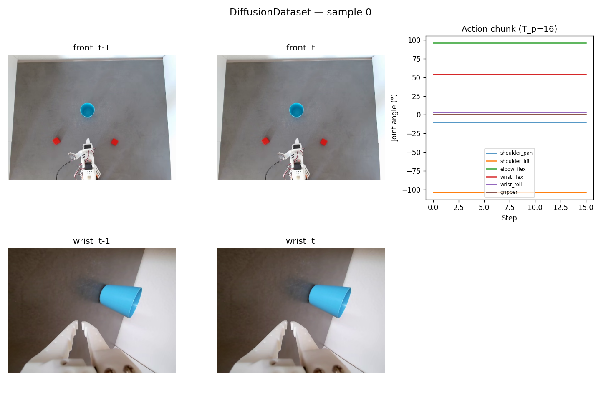

# Multimodal Manipulation Benchmark

[](https://www.python.org/)
[](https://pytorch.org/)
[](https://diffusion-policy.cs.columbia.edu/)
[]()
[](https://huggingface.co/datasets/yeeegem/redcubes_bluecup)

A reproducible benchmark for evaluating multimodal imitation-learning policies on an SO-ARM101 arm. Reimplements Diffusion Policy (Chi et al., 2023) from scratch in PyTorch and compares it against behaviour-cloning and transformer-based action policies on a deliberately bimodal pick-and-place task, with quantitative metrics for success rate, mode commitment, midpoint collapse and robustness to layout perturbations.

---

## Research questions

1. Does Diffusion Policy actually represent the bimodal action distribution
   on a real arm, or does it collapse to one mode under realistic data sizes
   (about 100 episodes) and noisy proprioception?
2. How does it compare against a behaviour-cloning MSE baseline that is
   forced to regress through the mean, and against modern alternatives
   (ACT, flow matching) on the same hardware and the same eval protocol?
3. What is the latency vs success-rate trade-off of DDIM at deployment time
   (5 / 10 / 20 steps) versus full DDPM, when the closed-loop control budget
   is 33 ms at 30 fps?
4. Does the choice of denoiser backbone (1-D CNN U-Net vs Transformer)
   matter at this data scale, or is the encoder doing most of the work?
5. How sensitive is the policy to input choices: image resolution (96 x 96
   vs 480 x 640), observation horizon (1 / 2 / 4 frames), action chunk
   length (8 / 16 / 32 steps), and action representation (absolute angles
   vs deltas vs velocities)?
6. Can the model actually meet a real-time 30 Hz control budget end to end
   (camera capture, encode, sample, send_action) on a single commodity GPU?

Results live in "Results" at the end of this README. They are filled in
only after Phase 8 (eval harness) and Phase 9 (ablations) complete.

---

## Architecture



<details>
<summary>Same diagram as inline Mermaid (renders on GitHub)</summary>



</details>

The encoder runs **once per inference call**: each camera's two consecutive
frames go through their own ResNet18 (weights shared across the 2 obs
frames, separate across cameras), the proprioceptive state through a small
Linear + SiLU. All features concatenate into a **2176-D conditioning
vector**. The 47M-parameter 1-D temporal U-Net then denoises a random
(16, 6) tensor over **N DDIM steps** (default 10), conditioned on that
2176-D vector via FiLM. The output is denormalised back into degrees and
sent to the arm as **absolute joint-angle setpoints**; the Feetech motors'
firmware-side PID controllers do the actual position control.


---

## BC baseline

The behavior-cloning baseline (Phase 7) is the control for the multimodality
result. It reuses the **identical** observation encoder and 2176-D conditioning
vector, then swaps the iterative diffusion denoiser for a single-pass MLP head
trained with MSE. Everything downstream (chunking, normalisation,
receding-horizon execution) is unchanged.



The whole pipeline is **one deterministic regression** from observation to action
chunk, where Diffusion Policy runs an iterative DDIM denoising loop. On the bimodal
pick (left cube ~50%, right cube ~50%) the MSE optimum is the *average* of the two
valid chunks, so the gripper drives into the empty gap between the cubes and grasps
nothing. This regression-to-the-mean failure is exactly the behaviour the project
sets out to measure against Diffusion Policy, which instead commits to one mode. See
[`diffusion_policy_soarm/docs/bc_baseline_explained.ipynb`](diffusion_policy_soarm/docs/bc_baseline_explained.ipynb)
for a runnable numerical demonstration.

---

## What the model trains on

A random batch of (front, wrist, state, action) after normalisation:



Top row: front-camera frames. Middle row: wrist-camera frames. Bottom: the
normalised state and action chunks. This is exactly what the encoder and
denoiser see during training, after the same min-max normalisation that is
inverted at inference.

---

## Project plan and status

**Current step:** Phase 7 (BC baseline) landed in code; Phase 6 (autonomous-success
gate on the arm) is paused. The diffusion model runs end-to-end at ~50 ms inference
with DDIM at 10 steps (the default in the `infer:` config block, overridable on the CLI).

| # | Phase | Status | Output |
|---|---|---|---|
| 0 | Scaffold | done | repo layout, pyproject, config loader |
| 1 | Data pipeline | done | LeRobotDataset wrapper, normalizer, batch visualiser (`batch_sample.png`) |
| 2 | Diffusion core | done | cosine + linear schedules, `q_sample`, DDPM and DDIM samplers, 16/16 tests pass |
| 3 | Denoiser | done | ObservationEncoder 2176-D, ConditionalUNet1d 47M params, DiffusionModule end-to-end |
| 4 | Training loop | done | EMA, AMP, cosine + warmup LR, checkpointing, TensorBoard |
| 5 | Full training | done | 300 epochs at 96 x 96, final loss 0.00298, run `runs/main_96x96/20260528_185334` |
| 6 | Inference on arm | paused | `infer.py` complete; gate = one autonomous success (deferred) |
| 7 | BC MSE baseline | done | `models/bc.py` + `factory.py`, `configs/ablations/bc_baseline.yaml`, `tests/test_bc.py`, `docs/bc_baseline_explained.ipynb`; proves regression-to-mean on the bimodal task |
| 8 | Eval harness (3 tiers) | todo | tier A in-distribution, tier B distractors, tier C OOD; failure-category logging |
| 9 | Ablations | todo | see below |
| 10 | Writeup | todo | mini-paper PDF (`diffusion_policy_soarm/docs/writeup.md` is the scaffold) |

### Phase 9 ablations (planned)

Three families, each row a separate training run plus eval pass.

**Method comparisons** (Diffusion Policy vs alternatives on the same data
and eval protocol):

| Method | What it does differently | Hypothesis |
|---|---|---|
| BC MSE baseline (MLP) | direct regression to next action chunk | regresses to the mean on bimodal data; reaches into the gap between the cubes |
| ACT (Zhao et al. 2023) | CVAE + Transformer decoder on action chunks | competitive on unimodal sub-tasks but should also collapse modes since the prior is Gaussian |
| Flow matching (Lipman et al. 2023) | conditional flow matching instead of DDPM, same encoder and same chunked output | matches diffusion quality in 1 to 4 sampling steps, much lower inference latency |

**Architectural ablations of Diffusion Policy itself:**

| Axis | Default | Variants tested |
|---|---|---|
| Denoiser backbone | 1-D U-Net (CNN) | Transformer (`configs/ablations/transformer_backbone.yaml`) |
| Sampler | DDPM (T=100) | DDIM with N in {5, 10, 20} |
| Noise schedule | cosine | linear (Ho et al. 2020) |
| EMA at inference | on (decay 0.9999) | off (raw last weights) |
| Conditioning | FiLM | classifier-free guidance with 10% obs-dropout at training time |

**Control-loop and input ablations:**

| Axis | Default | Variants tested |
|---|---|---|
| Image resolution | 480 x 640 (native) | 96 x 96 (`dataset.image_size=[96,96]`, faster run) |
| Action chunk length | T_p=16, T_a=8 (`base.yaml`; saved `main_96x96` used T_a=4) | (T_p=8, T_a=4); (T_p=32, T_a=16) |
| Observation horizon | T_o=2 | T_o=1 (no implicit velocity); T_o=4 |
| Action representation | absolute joint angles (deg) | per-step deltas (deg/tick); joint velocities (deg/s) |

Each row produces one entry in the final eval table (Tier A success,
latency, parameter count). The Method-comparison rows are the headline
result; the architectural and control rows are the in-depth ablation
block.

---

## Repository layout

```
diffusion_policy_soarm/
  configs/            # base config + ablation override YAMLs
  data/               # dataset wrapper, normalization, batch visualizer
  models/
    encoders.py       # per-camera ResNet encoder + state embedding
    cnn_backbone.py   # 1-D temporal U-Net denoiser with FiLM conditioning
    transformer_backbone.py  # Transformer denoiser (ablation)
    diffusion.py      # noise schedule, q_sample, loss, DDPM + DDIM samplers
    bc.py             # behaviour-cloning baseline (MLP head + MSE)
    factory.py        # build_policy: dispatch diffusion vs bc on model.type
  utils/              # config loading/merging, global seeding
  train.py            # training entry point
  infer.py            # real-time receding-horizon inference loop
  eval/               # three-tier eval harness, failure logging, metrics
  scripts/            # pre-extract video frames to disk
  docs/
    how_it_works.md             # maps DDPM math to code; start here
    main_96x96_explained.ipynb  # full walkthrough of the main run
    main_96x96_audit.ipynb      # audit of the main run against the paper
    bc_baseline_explained.ipynb # BC baseline walkthrough + mode-collapse demo
    architecture.png            # diagram embedded above
    writeup.md                  # mini-paper scaffold
recordings/           # LeRobotDataset v3.0 (not committed; symlink or set path)
runs/                 # training run outputs (one timestamped dir per run)
```

---

## Setup

Requires Python 3.13 and [uv](https://docs.astral.sh/uv/).

```bash
uv sync                     # creates .venv and installs all dependencies
uv sync --extra dev         # also installs pytest and ruff
```

---

## Reproduction

### 1. Pre-extract video frames (one-time, ~10 min)

Decodes all videos to numpy arrays so the training hot-path is pure RAM
and disk reads, with no per-batch video decoding. Safe to interrupt and
re-run (skips completed episodes).

```bash
uv run python -m diffusion_policy_soarm.scripts.preextract_frames \
    --config diffusion_policy_soarm/configs/base.yaml
```

Cache is written to `recordings/redcubes_bluecup/frame_cache/`. At native
480 x 640 (about 60 GB) it is memory-mapped rather than loaded into RAM
(`preload_cache: false`), since the cache exceeds available system memory.

### 2. Full training

```bash
uv run python -m diffusion_policy_soarm.train \
    --config diffusion_policy_soarm/configs/base.yaml \
    training.experiment=main_480x640
```

Runs are saved to `runs/<experiment>/<YYYYMMDD_HHMMSS>/`. Each run
directory contains `config.yaml`, `tb/` (TensorBoard), and `checkpoints/`
with `best.pt` and `latest.pt`.

**Resume an interrupted run:**
```bash
uv run python -m diffusion_policy_soarm.train \
    --config diffusion_policy_soarm/configs/base.yaml \
    training.experiment=main_480x640 \
    --resume runs/main_480x640/<timestamp>
```

**Monitor training:**
```bash
uv run tensorboard --logdir runs/
# open http://localhost:6006
```

### 3. Ablations

```bash
# Low-resolution (96x96) ablation: re-extract cache first at 96x96
uv run python -m diffusion_policy_soarm.scripts.preextract_frames \
    --config diffusion_policy_soarm/configs/base.yaml \
    dataset.image_size=[96,96]

uv run python -m diffusion_policy_soarm.train \
    --config diffusion_policy_soarm/configs/base.yaml \
    dataset.image_size=[96,96] dataset.preload_cache=true \
    training.batch_size=256 training.num_workers=6 \
    training.experiment=ablation_96x96

# Transformer backbone
uv run python -m diffusion_policy_soarm.train \
    --config diffusion_policy_soarm/configs/base.yaml \
    --override diffusion_policy_soarm/configs/ablations/transformer_backbone.yaml \
    training.experiment=ablation_transformer

# DDIM fast sampler
uv run python -m diffusion_policy_soarm.train \
    --config diffusion_policy_soarm/configs/base.yaml \
    --override diffusion_policy_soarm/configs/ablations/ddim_sampler.yaml \
    training.experiment=ablation_ddim
```

### 4. Inference on the arm

**Run on the arm:**
```bash
uv run python -m diffusion_policy_soarm.infer \
    --checkpoint runs/<experiment>/<timestamp>/checkpoints/best.pt \
    --config runs/<experiment>/<timestamp>/config.yaml
```

The first time you connect: pass `id=<your_arm_id>` via `infer.robot_id`
in the config so LeRobot reads calibration from
`~/.cache/huggingface/lerobot/calibration/robots/so_follower/<id>.json`.
You should see a sequence of latency lines once the loop starts:

```
inference 47.3 ms | mean 49.1 | p95 56.0
```

The deployed loop warm-starts the next DDIM sample from the unexecuted
suffix of the previous action chunk. This improves temporal consistency
across replans compared with restarting each chunk from fresh Gaussian
noise.

---

## Training hardware and cost

All numbers below are wall-clock on a single NVIDIA RTX A5000 (24 GB VRAM,
RTX 3080-class compute, similar TFLOPs to a consumer RTX 3080).

Single NVIDIA RTX A5000 (16 GB VRAM, laptop GPU).

| Run | Resolution | Epochs | Wall clock |
|---|---|---|---|
| Baseline | 480 x 640 | 80 | ~22 hours |
| 96 x 96 ablation | 96 x 96 | 80 | TBD |

---

## Lessons from the build

A short retrospective of issues that actually slowed the project down and
how they were resolved. These shaped several of the design choices above.

### Phase 6: arm jittered in place

First on-arm run: the model loaded, latency stayed in budget, but the arm
just twitched at the starting pose instead of moving toward the cubes.
Diagnosis came from printing the denormalised actions:
`shoulder_lift` and `elbow_flex` were pinned exactly at the normalizer's
min and max (-103.56 and +96.88 deg). That is the signature of
`clip_sample=True` saturating: the DDIM x-hat-zero estimate was outside
[-1, +1] at every step and the clip was hitting both rails. Root cause:
the arm was started in a pose far from the training distribution, so the
conditioning vector was out of distribution and the denoiser fell back
to extreme predictions. Fix: home the arm to the same neutral pose used
at the start of training episodes before running `infer.py`.

### Phase 6: arm moved much faster than during teleop

Even with reasonable predictions, the arm slammed to each new commanded
position. Teleop felt slow because the leader arm moved at human hand
speed and each step's delta was small; the diffusion model can predict
5 to 20 degree jumps between consecutive chunk steps because the data
distribution contains some fast motions. With the Feetech `Acceleration`
register at its near-max default, each delta executes at full motor
speed.

Fix landed in one place:
- A direct write to the Feetech `Acceleration` register
  (`infer.motor_acceleration`, default 64 of 255) right after
  `robot.connect()`. This lowers the firmware ramp rate so even an
  large commanded delta executes more gently. Persists until power cycle.

### Phase 6: serial bus dropped at 100 DDIM steps

Running with `infer.num_inference_steps=100` (effectively full DDPM) produced
`ConnectionError: There is no status packet!` after a few hundred ms. The
serial bus to the Feetech motors has its own packet timeout, and an
inference call that took about 530 ms blew through it. DDIM at 5 to 10
steps brings inference to 26 to 50 ms and fixes this; the same number
also keeps the loop inside the 33 ms control budget.

### Phase 6: hardware integration footguns

Three small but real time sinks during the initial bring-up:

1. The motor driver shipped as `scservo_sdk` is not on PyPI under that
   name. It is bundled inside the `feetech-servo-sdk` PyPI package; that
   is the correct dependency to add.
2. `FeetechMotorsBus` exposes motor names via `robot.bus.motors.keys()`,
   not `robot.bus.motor_names` (the old API).
3. Calibration: instead of calling `write_calibration` manually, pass
   `id="<your_arm_id>"` to `SOFollowerRobotConfig`. LeRobot then loads
   the calibration JSON from
   `~/.cache/huggingface/lerobot/calibration/robots/so_follower/<id>.json`
   on `robot.connect()`, and `robot.bus.is_calibrated` is already true.

---

## Design decisions

| Decision | Choice | Rationale |
|---|---|---|
| Noise schedule | Cosine | Better signal retention for low-dim actions vs linear |
| Prediction target | epsilon (noise) | Cleaner gradient signal vs x-zero prediction |
| Conditioning | FiLM on [t_emb; obs_emb] | Matches paper; no CFG needed at this scale |
| Normalisation | Min-max to [-1, +1] | Required by `clip_sample` and bounded noise schedule |
| Sampler | DDPM train, DDIM infer | DDIM is about 10x faster with same quality at 10 to 20 steps |
| EMA | decay = 0.9999 | Standard for diffusion; always use EMA weights for eval |
| Warm-start | shift previous action chunk suffix into next DDIM init | Improves temporal consistency across replans |
| Motor accel | Feetech `Acceleration` register lowered to 64 | Slows the firmware-side ramp without altering policy outputs |

---

## Results

Filled in after Phase 8 (eval harness) and Phase 9 (ablations) land. Until
then, treat this section as a placeholder.

- **Headline:** [pending] Diffusion Policy vs BC MSE baseline, Tier A
  success and mode-balance.
- **Method comparisons:** [pending] Diffusion Policy vs ACT vs flow
  matching on the same eval.
- **DDIM step count:** [pending] success and latency at N in {5, 10, 20,
  100}.
- **Architectural and input ablations:** [pending] table per row in
  "Phase 9 ablations" above.

---

## Citation

```bibtex
@inproceedings{chi2023diffusion,
  title     = {Diffusion Policy: Visuomotor Policy Learning via Action Diffusion},
  author    = {Chi, Cheng and Feng, Siyuan and Du, Yilun and Xu, Zhenjia and
               Cousineau, Eric and Burchfiel, Benjamin and Song, Shuran},
  booktitle = {Robotics: Science and Systems},
  year      = {2023}
}
```
